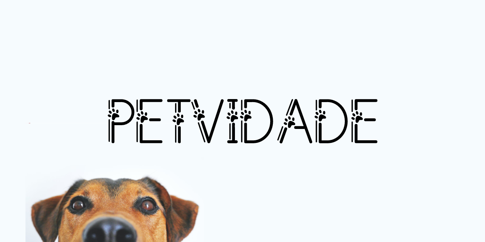

## Petvidade

Petvidade é um projeto que visa ajudar pessoas a caminhar com seus pets, ver curiosidades, encontrar petshops e muito mais.

-   Cadastro e Gerenciamento de Pets: Cadastro de informações dos animais de
    estimação, como: nome, raça, vacinas, medicamentos, lembretes e produtos
    utilizados pelo animal. Além da edição e exclusão dos dados;
-   Registro de Caminhadas: Registrar o caminho e histórico de caminhadas, a
    distância total percorrida, além de demarcar o caminho realizado em um mapa.
    Exibir informações extras ao fim da caminhada, entre eles, a distância total
    percorrida em quilômetros e quantidade de patadas;
-   Rede Social integrada ao Aplicativo: Mini rede social para compartilhamento de
    caminhadas, onde os usuários possam curtir e comentar sobre e seguir uns aos
    outros. Será possível visualizar as caminhadas de amigos ou caminhadas
    compartilhadas publicamente;
-   Locais pet-friendly: Cadastro de locais na qual é possível entrar e utilizar os
    serviços com seu pet (realizado pelos usuários e aprovados por administradores);
-   Pet Shops e Veterinários: Cadastro de pet shops e veterinários disponíveis para
    consulta, além de disponibilizar uma opção que indica que o local fica aberto 24h
    (realizado pelos usuários e aprovados por administradores);
-   Micro blog com dicas e curiosidades: Micro blog do Petvidade para disponibilizar
    dicas, ideias e sugestões para os pets, onde o conteúdo gerado será de autoria da
    CONTRATANTE;

[Protótipo](https://www.figma.com/proto/X2OgSNzvn7L9fmYf9eSBIM/Petvidade?node-id=368%3A103&scaling=scale-down&page-id=0%3A1&starting-point-node-id=1%3A2)

[Automação de Build](https://github.com/expo/expo-github-action)

Seria legal dar uma olhada e pensar em uma substituição:
[Expo Router](https://github.com/expo/router)

// calculate km from coordentes

```ts
function deg2rad(deg) {
	return deg * (Math.PI / 180);
}

function getDistanceFromLatLonInKm(lat1, lon1, lat2, lon2) {
	var R = 6371; // Radius of the earth in km
	var dLat = deg2rad(lat2 - lat1); // deg2rad below
	var dLon = deg2rad(lon2 - lon1);
	var a = Math.sin(dLat / 2) * Math.sin(dLat / 2) + Math.cos(deg2rad(lat1)) * Math.cos(deg2rad(lat2)) * Math.sin(dLon / 2) * Math.sin(dLon / 2);
	var c = 2 * Math.atan2(Math.sqrt(a), Math.sqrt(1 - a));
	var d = R * c; // Distance in km
	return d;
}

getDistanceFromLatLonInKm(51.508742, -0.12085, 51.509991, -0.133799);
```
